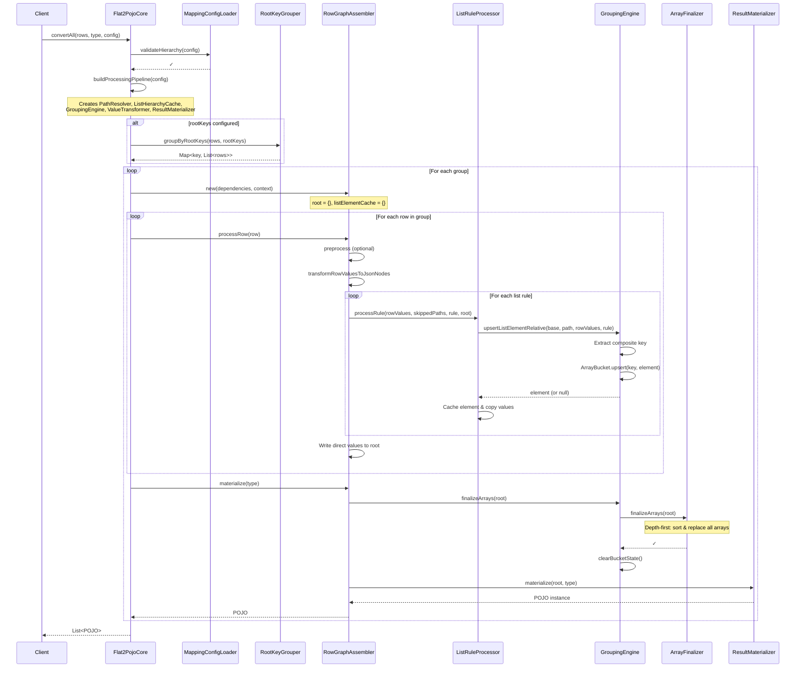
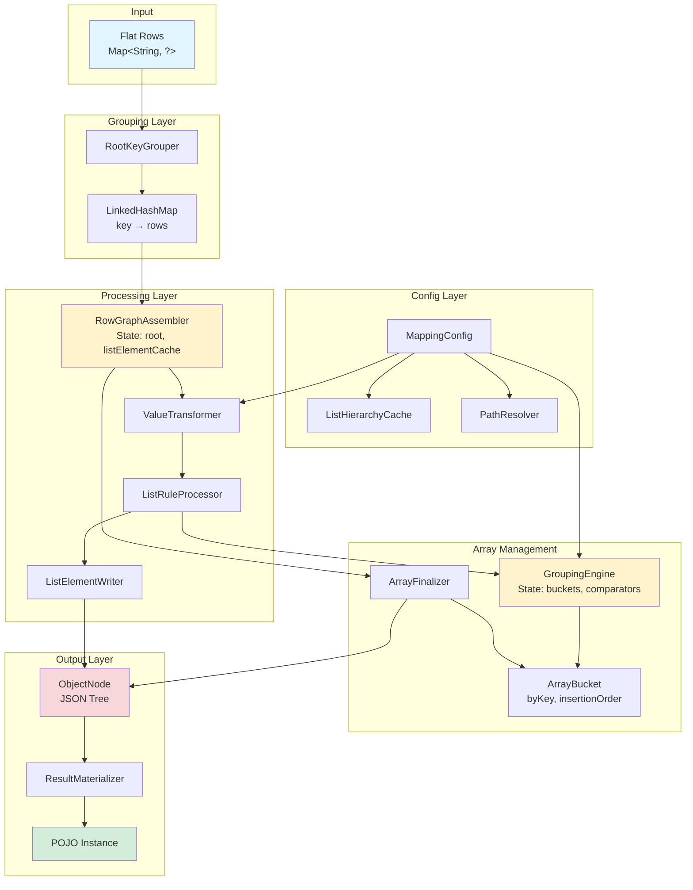

# FLAT2POJO: Converting Flat Key-Value Maps to Nested POJOs

**Generated:** 2025-10-09
**Commit:** 9f9315f
**Modules:** flat2pojo-core, flat2pojo-examples

---

## HIGH-LEVEL OVERVIEW

**Input:**  List of flat Maps (e.g., `{"person/name": "Alice", "person/age": 30}`)
**Output:** List of POJOs (e.g., `Person{name="Alice", age=30}`)

**Core Pipeline (6 Steps):**
1. Validate configuration hierarchy (parents before children)
2. Group rows by root keys (if configured)
3. Process each group independently
4. Transform flat values to JsonNode trees
5. Finalize arrays (sort, deduplicate)
6. Materialize JSON to target POJO type

## MAIN ALGORITHM: convertAll(rows, targetType, config)

```
1. VALIDATE configuration hierarchy
   ├─ Ensure parent lists declared before children
   ├─ Validate keyPaths are relative (not absolute)
   └─ Validate orderBy paths are relative

2. BUILD processing pipeline
   ├─ Create PathResolver (separator-aware path operations)
   ├─ Build ListHierarchyCache (parent-child list relationships)
   ├─ Create GroupingEngine (array management with deduplication)
   ├─ Create ValueTransformer (value→JsonNode conversion)
   └─ Create ResultMaterializer (JSON→POJO converter)

3. BRANCH by rootKeys configuration
   IF rootKeys.isEmpty():
     → convertWithoutGrouping(all rows as single group)
   ELSE:
     → convertWithGrouping(group by root keys)

4. RETURN list of POJOs
```

### convertWithoutGrouping(rows, type, pipeline)
```
1. assembler = pipeline.createAssembler()  // RowGraphAssembler
2. FOR EACH row IN rows:
     assembler.processRow(row)
3. RETURN [assembler.materialize(type)]     // Single POJO
```

### convertWithGrouping(rows, type, config, pipeline)
```
1. rowGroups = RootKeyGrouper.groupByRootKeys(rows, config.rootKeys())
   └─ Returns LinkedHashMap<compositeKey, List<rows>> preserving insertion order

2. results = []
3. FOR EACH groupRows IN rowGroups.values():
     assembler = pipeline.createAssembler()
     FOR EACH row IN groupRows:
       assembler.processRow(row)
     results.add(assembler.materialize(type))

4. RETURN results
```

## ROW PROCESSING: RowGraphAssembler.processRow(row)

The RowGraphAssembler maintains state across all rows in a group:
- root: ObjectNode (accumulated JSON tree)
- listElementCache: Map<listPath, currentElement> (shared across rows in group)

```
PHASE 1: Optional preprocessing
IF valuePreprocessor configured:
  row = valuePreprocessor.process(row)

PHASE 2: Value transformation
rowValues = valueTransformer.transformRowValuesToJsonNodes(row)
  └─ Flat map → Map<path, JsonNode> with primitives split, blanks nullified

PHASE 3: Process list rules hierarchically
skippedListPaths = {}
FOR EACH listRule IN config.lists() (declaration order):
  ListRuleProcessor.processRule(rowValues, skippedListPaths, rule, root)

PHASE 4: Write direct (non-list) values
FOR EACH entry IN rowValues:
  IF NOT underAnyList(path) AND NOT underSkippedList(path):
    ListElementWriter.writeDirectly(root, path, value)
```

## KEY COLLABORATORS

### 1. ListRuleProcessor: Processes a single list rule for a row

```
processRule(rowValues, skippedListPaths, rule, root):

STEP 1: Check parent status
IF rule.path is under any skippedListPath:
  WARN and RETURN (skip this rule)

STEP 2: Determine base object and relative path
parentListPath = hierarchyCache.getParentListPath(rule.path)
IF parentListPath exists:
  baseObject = listElementCache[parentListPath]  // Nested list
  relativePath = tailAfter(rule.path, parentListPath)
ELSE:
  baseObject = root                               // Top-level list
  relativePath = rule.path

STEP 3: Create/get list element
listElement = groupingEngine.upsertListElementRelative(
  baseObject, relativePath, rowValues, rule
)

IF listElement is null:  // Missing keyPath values
  skippedListPaths.add(rule.path)
  WARN about missing keyPaths
  RETURN

STEP 4: Cache element and copy values
listElementCache[rule.path] = listElement
copyValuesToElement(rowValues, listElement, rule)
```

### 2. GroupingEngine: Manages arrays with deduplication and sorting

**State (per RowGraphAssembler instance):**
- buckets: IdentityHashMap<ArrayNode, ArrayBucket>
- comparators: IdentityHashMap<ArrayNode, List<Comparator<ObjectNode>>>

```
upsertListElementRelative(base, relativeListPath, rowValues, rule):

STEP 1: Resolve array node
parentNode = traverseAndEnsurePath(base, relativeListPath)
arrayField = getFinalSegment(relativeListPath)
arrayNode = parentNode.withArray(arrayField)

STEP 2: Ensure bucket state
bucket = buckets.computeIfAbsent(arrayNode, → new ArrayBucket())
comparators.computeIfAbsent(arrayNode, → precomputed comparators for rule.path)

STEP 3: Extract composite key
keyValues = []
FOR EACH relativeKeyPath IN rule.keyPaths():
  absoluteKeyPath = rule.path + separator + relativeKeyPath
  value = rowValues[absoluteKeyPath]
  IF value is null or missing:
    RETURN null  // Signal to skip this element
  keyValues.add(value)
compositeKey = new CompositeKey(keyValues)

STEP 4: Upsert into bucket
element = bucket.upsert(compositeKey, objectMapper.createObjectNode())
RETURN element

---

finalizeArrays(root):
arrayFinalizer = new ArrayFinalizer(buckets, comparators)
arrayFinalizer.finalizeArrays(root)  // Depth-first traversal
clearBucketState()                    // Prevent memory leaks
```

### 3. ArrayBucket: Deduplicates elements by composite key

**Implementation:** First-write-wins semantics

```
State:
- byKey: LinkedHashMap<CompositeKey, ObjectNode>
- insertionOrder: List<ObjectNode>
- cachedSortedElements: List<ObjectNode> (cached for performance)

upsert(key, candidate):
IF key exists in byKey:
  RETURN byKey[key]  // Return existing, ignore candidate
ELSE:
  byKey[key] = candidate
  insertionOrder.add(candidate)
  invalidateCache()
  RETURN candidate

ordered(comparators):
IF cache is valid for these comparators:
  RETURN cachedSortedElements
ELSE:
  elements = new ArrayList(byKey.values())
  IF comparators not empty:
    elements.sort(combineComparators(comparators))
  cache(comparators, elements)
  RETURN elements
```

### 4. ArrayFinalizer: Finalizes all arrays in the tree

```
finalizeArrays(root):

Depth-first traversal using stack:
stack = [root]
WHILE stack not empty:
  current = stack.pop()
  IF current is ObjectNode:
    FOR EACH child IN current.fieldValues():
      stack.push(child)
  ELSE IF current is ArrayNode:
    applyBucketOrdering(current)
    FOR EACH child IN current:
      stack.push(child)

applyBucketOrdering(arrayNode):
bucket = buckets[arrayNode]
IF bucket exists:
  comparators = comparators[arrayNode] or []
  sortedElements = bucket.ordered(comparators)
  arrayNode.removeAll()
  FOR EACH element IN sortedElements:
    arrayNode.add(element)
```

### 5. ValueTransformer: Transforms flat values to JsonNode

```
transformRowValuesToJsonNodes(row):

result = LinkedHashMap(row.size)
FOR EACH key→value IN row:

  STEP 1: Normalize blank values
  IF blanksAsNulls AND value is blank string:
    normalized = null
  ELSE:
    normalized = value

  STEP 2: Check for primitive split rule
  splitRule = splitRulesCache[key]
  IF splitRule exists AND normalized is String:
    valueNode = createSplitArrayNode(normalized, splitRule)
  ELSE:
    valueNode = createLeafNode(normalized)

  result[key] = valueNode

RETURN result

---

createSplitArrayNode(stringValue, splitRule):
parts = stringValue.split(splitRule.delimiter)
arrayNode = objectMapper.createArrayNode()
FOR EACH part IN parts:
  processed = splitRule.trim ? part.trim() : part
  element = blanksAsNulls AND processed.isBlank() ? NullNode : TextNode(processed)
  arrayNode.add(element)
RETURN arrayNode

createLeafNode(value):
RETURN SWITCH value:
  case null → NullNode
  case String s → blanksAsNulls AND s.isBlank() ? NullNode : TextNode(s)
  case Integer i → IntNode(i)
  case Long l → LongNode(l)
  case Double d → DoubleNode(d)
  case Boolean b → BooleanNode(b)
  default → objectMapper.valueToTree(value)
```

### 6. ListElementWriter: Writes values with conflict handling

```
writeWithConflictPolicy(target, path, value, policy, absolutePath):
IF path.isEmpty():
  RETURN  // Skip empty paths

parent = pathResolver.traverseAndEnsurePath(target, path)
lastSegment = pathResolver.getFinalSegment(path)
conflictContext = new ConflictContext(policy, absolutePath, reporter)

ConflictHandler.writeScalarWithPolicy(parent, lastSegment, value, conflictContext)

---

writeDirectly(target, path, value):
IF path.isEmpty():
  RETURN

parent = pathResolver.traverseAndEnsurePath(target, path)
lastSegment = pathResolver.getFinalSegment(path)
parent.set(lastSegment, value)  // Direct overwrite
```

### 7. ConflictHandler: Resolves field conflicts

```
writeScalarWithPolicy(target, field, newValue, context):

existing = target[field]
IF existing is null:
  target[field] = newValue
  RETURN

SWITCH context.policy:
  case error:
    THROW Flat2PojoException("Conflict at " + context.absolutePath)

  case firstWriteWins:
    RETURN  // Keep existing, ignore newValue

  case lastWriteWins:
    target[field] = newValue

  case merge:
    IF both are ObjectNode:
      deepMerge(existing, newValue)
    ELSE:
      target[field] = newValue  // Fallback to lastWriteWins
```

### 8. ListHierarchyCache: Pre-computed list hierarchy

**Computed once per config:**

```
State:
- parentListPaths: Map<childListPath, parentListPath>
- declaredListPaths: Set<String> (all list paths from config)

buildParentListPaths(config):
sortedPaths = config.lists().sortByPathLength()
result = {}

FOR EACH childPath IN sortedPaths:
  FOR EACH potentialParent IN sortedPaths (shorter paths):
    IF childPath.startsWith(potentialParent + separator):
      result[childPath] = potentialParent
      BREAK  // Found parent

RETURN result

---

getParentListPath(listPath):
RETURN parentListPaths[listPath]  // null if top-level

isUnderAnyList(path):
RETURN pathResolver.isUnderAny(path, declaredListPaths)

isUnderAnyChildList(suffix, parentPath):
FOR EACH listPath IN declaredListPaths:
  IF listPath.startsWith(parentPath + separator):
    childRelativePath = listPath.substring(parentPath.length + 1)
    IF suffix.startsWith(childRelativePath + separator):
      RETURN true
RETURN false
```

### 9. ResultMaterializer: JSON to POJO conversion

```
materialize(root, type):

TRY:
  IF type is JsonNode:
    RETURN root  // Skip conversion
  ELSE:
    RETURN objectMapper.treeToValue(root, type)  // Jackson conversion
CATCH Exception e:
  THROW Flat2PojoException("Failed to map result to " + type, e)
```

## PERFORMANCE CHARACTERISTICS

### Time Complexity
- **Overall:** O(n × m) where n = rows, m = average values per row
- **List hierarchy lookup:** O(1) via ListHierarchyCache pre-computation
- **Parent lookup:** O(1) via parentListPaths map
- **Path operations:** O(k) where k = path depth (typically small constant)

### Space Complexity
- **ListHierarchyCache:** O(L) where L = number of list rules
- **ArrayBuckets:** O(E) where E = total unique list elements across all arrays
- **RowGraphAssembler:** O(V) where V = values per group (accumulated JSON tree)
- **Per-row:** O(m) for transformed values map

### Key Optimizations
1. **IdentityHashMap for buckets** - Avoids `.equals()` overhead on ArrayNode keys
2. **ListHierarchyCache pre-computation** - Parent relationships computed once per config
3. **Sorted path processing** - O(n log n) cache build instead of O(n²)
4. **Bucket sorting cache** - Sorted elements cached until bucket changes
5. **LinkedHashMap ordering** - Preserves insertion order for deterministic output

### Hot Paths
1. **ValueTransformer.transformRowValuesToJsonNodes** - Called once per row
2. **GroupingEngine.upsertListElementRelative** - Called once per list rule per row
3. **ArrayBucket.upsert** - Called for each list element creation
4. **ArrayFinalizer.finalizeArrays** - Called once per group (depth-first tree walk)

## CORRECTNESS GUARANTEES

### Hierarchical Processing
Lists processed in **declaration order** ensures:
- Parent lists populated before children
- Child elements inserted into correct parent element from listElementCache
- Validation catches missing parent declarations at startup

### Deduplication Semantics
Composite keys ensure:
- Elements with same keyPath values deduplicated per array
- First-write-wins: first row establishes element, subsequent rows populate it
- Works correctly across multiple rows in the same group

### Data Integrity
- Missing keyPath values → skip list element, add to skippedListPaths, warn via Reporter
- Skipped parents → skip all child lists (isUnderAny check)
- Conflict policies prevent silent data loss (configurable: error, firstWriteWins, lastWriteWins, merge)
- Bucket state cleared after finalization to prevent leaks across groups

## EXAMPLE EXECUTION

### Simple Case: Order with Line Items

**Input Rows:**
```
Row 1: {order/id: "123", order/items/id: "A", order/items/name: "Widget", order/items/qty: "2"}
Row 2: {order/id: "123", order/items/id: "B", order/items/name: "Gadget", order/items/qty: "1"}
```

**Config:**
```yaml
lists:
  - path: "order/items"
    keyPaths: ["id"]  # Relative to order/items
    dedupe: true
```

**Execution Trace:**

```
SETUP:
- rootKeys: [] → single group
- Create RowGraphAssembler:
  - root = {}
  - listElementCache = {}

ROW 1:
1. Transform: {"order/id": TextNode("123"), "order/items/id": TextNode("A"), ...}
2. Process list "order/items":
   - parentListPath = null (top-level)
   - baseObject = root
   - Extract key from rowValues["order/items/id"] = "A"
   - compositeKey = ["A"]
   - Upsert into bucket → NEW element created
   - listElementCache["order/items"] = element
   - Copy values: element.id = "A", element.name = "Widget", element.qty = "2"
3. Write direct values: root.order.id = "123"

ROW 2:
1. Transform: {"order/id": TextNode("123"), "order/items/id": TextNode("B"), ...}
2. Process list "order/items":
   - compositeKey = ["B"]
   - Upsert into bucket → NEW element created
   - listElementCache["order/items"] = element  (OVERWRITE cache with new element)
   - Copy values: element.id = "B", element.name = "Gadget", element.qty = "1"
3. Write direct values: root.order.id = "123" (already set, no conflict)

FINALIZE:
- ArrayFinalizer walks tree
- For arrayNode at root.order.items:
  - bucket.ordered([]) → [element_A, element_B] (insertion order)
  - Replace arrayNode contents

MATERIALIZE:
- Jackson converts root to Order.class
```

**Result:**
```json
{
  "order": {
    "id": "123",
    "items": [
      {"id": "A", "name": "Widget", "qty": "2"},
      {"id": "B", "name": "Gadget", "qty": "1"}
    ]
  }
}
```

### Complex Case: Nested Lists with Grouping

**Input:** Definitions with nested modules (see SpecSuiteTest for real examples)

**Key Insight:** listElementCache updates per row, allowing nested list elements to be written to the correct parent element established in the same row.

## DIAGRAMS

### Sequence Diagram: convertAll Flow



### Component Diagram: Data Flow



## DESIGN RATIONALE

### Why Direct Value Transformation (Not Build-Then-Flatten)?

**Current Implementation:** `ValueTransformer.transformRowValuesToJsonNodes` directly produces `Map<String, JsonNode>` without building an intermediate tree.

**Rationale:**
- List processing needs **paths** to extract composite keys (e.g., `"order/items/id"` → key for deduplication)
- Building a tree just to flatten it again is wasteful
- Direct transformation applies primitives split and blanksAsNulls in one pass
- Simpler to work with flat path→value map for routing to list elements

### Why Jackson-First?

Building a JSON tree first (via Jackson's ObjectNode) provides:
- **Type safety:** JsonNode types match POJO field types
- **Compatibility:** Existing Jackson annotations and deserializers work seamlessly
- **Simplicity:** Let Jackson handle all type conversion edge cases
- **Testability:** Can verify intermediate JSON structure before materialization

### Why Hierarchical Processing?

Processing lists in declaration order enables:
- **Nested lists:** Child lists inserted into parent elements via listElementCache
- **Early validation:** Catch missing parent declarations at startup
- **Cache efficiency:** Parent element available when processing child in same row
- **Determinism:** Predictable processing order, no hidden dependencies

### Why IdentityHashMap for Buckets?

- ArrayNode identity uniquely identifies each array in the tree
- Avoids expensive `.equals()` calls on large ArrayNode instances
- Matches natural tree structure (one bucket per physical array node)

## RELATED DOCUMENTATION

- [MAPPING.md](MAPPING.md) - Configuration schema, field mapping rules, and semantic constraints
- [OPERATIONS.md](OPERATIONS.md) - API guide, production deployment, monitoring, and troubleshooting
- [README.md](README.md) - Project overview, quick start, and getting started guide

## SOURCES

All pseudocode derived from code inspection at commit `9f9315f`:

### Core Entry Points
- `flat2pojo-core/src/main/java/io/github/pojotools/flat2pojo/core/api/Flat2Pojo.java`
- `flat2pojo-core/src/main/java/io/github/pojotools/flat2pojo/core/impl/Flat2PojoCore.java` (lines 42-111)

### Grouping & Processing
- `flat2pojo-core/src/main/java/io/github/pojotools/flat2pojo/core/impl/RootKeyGrouper.java` (lines 25-58)
- `flat2pojo-core/src/main/java/io/github/pojotools/flat2pojo/core/impl/RowGraphAssembler.java` (lines 38-84)
- `flat2pojo-core/src/main/java/io/github/pojotools/flat2pojo/core/impl/ProcessingPipeline.java`

### List Processing
- `flat2pojo-core/src/main/java/io/github/pojotools/flat2pojo/core/impl/ListRuleProcessor.java` (lines 31-133)
- `flat2pojo-core/src/main/java/io/github/pojotools/flat2pojo/core/impl/ListElementWriter.java` (lines 20-48)

### Array Management
- `flat2pojo-core/src/main/java/io/github/pojotools/flat2pojo/core/engine/GroupingEngine.java` (lines 36-92)
- `flat2pojo-core/src/main/java/io/github/pojotools/flat2pojo/core/engine/ArrayBucket.java` (lines 27-78)
- `flat2pojo-core/src/main/java/io/github/pojotools/flat2pojo/core/engine/ArrayFinalizer.java` (lines 29-76)

### Value Transformation
- `flat2pojo-core/src/main/java/io/github/pojotools/flat2pojo/core/engine/ValueTransformer.java` (lines 45-112)
- `flat2pojo-core/src/main/java/io/github/pojotools/flat2pojo/core/util/ConflictHandler.java`

### Configuration & Caching
- `flat2pojo-core/src/main/java/io/github/pojotools/flat2pojo/core/config/MappingConfig.java` (lines 32-192)
- `flat2pojo-core/src/main/java/io/github/pojotools/flat2pojo/core/config/MappingConfigLoader.java` (lines 20-124)
- `flat2pojo-core/src/main/java/io/github/pojotools/flat2pojo/core/config/ListHierarchyCache.java` (lines 19-57)
- `flat2pojo-core/src/main/java/io/github/pojotools/flat2pojo/core/util/PathResolver.java` (lines 10-74)

### Materialization
- `flat2pojo-core/src/main/java/io/github/pojotools/flat2pojo/core/impl/ResultMaterializer.java` (lines 19-31)

---

**End of Document**
