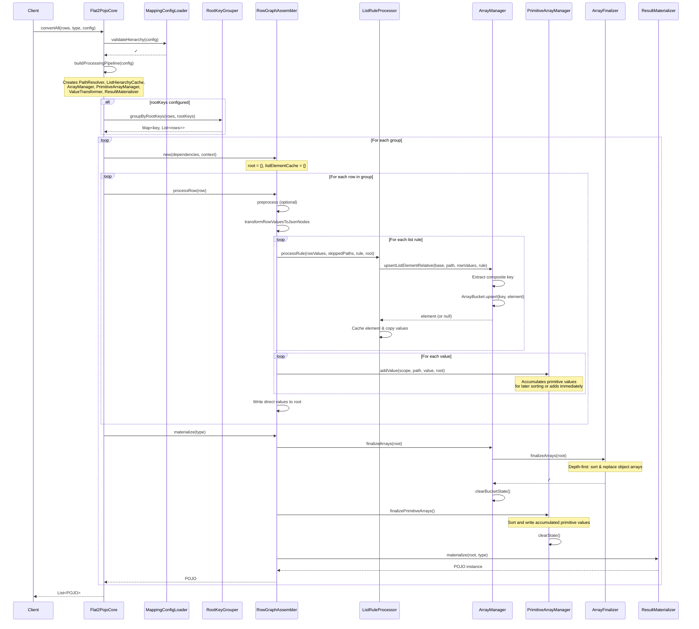
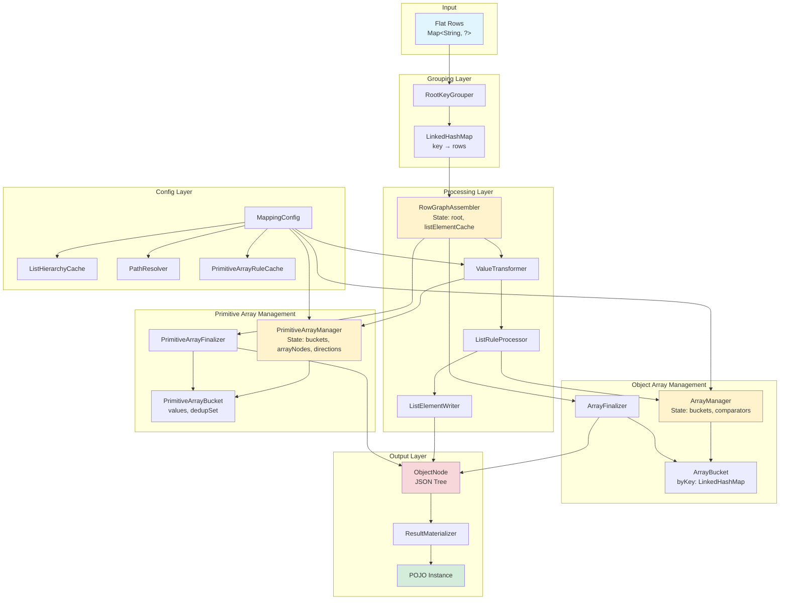

# FLAT2POJO: Converting Flat Key-Value Maps to Nested POJOs

**Generated:** 2024-10-09  
**Updated:** 2025-10-14 (Architecture refactoring)  
**Commit:** 9f9315f  
**Modules:** flat2pojo-core, flat2pojo-examples

---

## HIGH-LEVEL OVERVIEW

**Input:**  List of flat Maps (e.g., `{"person/name": "Alice", "person/age": 30}`)
**Output:** List of POJOs (e.g., `Person{name="Alice", age=30}`)

**Core Pipeline (6 Steps):**
1. Validate configuration hierarchy (parents before children)
2. Group rows by root keys (if configured)
3. Process each group independently
4. Transform flat values to JsonNode trees
5. Finalize arrays (sort, deduplicate)
6. Materialize JSON to target POJO type

## MAIN ALGORITHM: convertAll(rows, targetType, config)

```
1. VALIDATE configuration hierarchy
   ├─ Ensure parent lists declared before children
   ├─ Validate keyPaths are relative (not absolute)
   └─ Validate orderBy paths are relative

2. BUILD processing pipeline
   ├─ Create AssemblerDependencies:
   │  ├─ PathResolver (separator-aware path operations)
   │  ├─ ListHierarchyCache (parent-child list relationships)
   │  ├─ ArrayNodeResolver (resolves/creates array nodes in tree)
   │  ├─ CompositeKeyExtractor (extracts composite keys from rows)
   │  ├─ ComparatorBuilder (precomputes orderBy comparators)
   │  ├─ PrimitiveArrayRuleCache (fast O(1) primitive list rule lookup)
   │  ├─ PrimitiveArrayNodeFactory (creates primitive array nodes)
   │  └─ ValueTransformer (value→JsonNode conversion)
   ├─ Create ProcessingContext:
   │  ├─ Reporter (warnings/errors callback)
   │  ├─ ValuePreprocessor (optional row transformation)
   │  └─ ConflictPolicy (from config)
   ├─ Create ProcessingPipeline (dependencies, context)
   └─ Create ResultMaterializer (JSON→POJO converter)

3. BRANCH by rootKeys configuration
   IF rootKeys.isEmpty():
     → convertWithoutGrouping(all rows as single group)
   ELSE:
     → convertWithGrouping(group by root keys)

4. RETURN list of POJOs
```

### convertWithoutGrouping(rows, type, pipeline)
```
1. assembler = pipeline.createAssembler()  // RowGraphAssembler
2. FOR EACH row IN rows:
     assembler.processRow(row)
3. RETURN [assembler.materialize(type)]     // Single POJO
```

### convertWithGrouping(rows, type, config, pipeline)
```
1. rowGroups = RootKeyGrouper.groupByRootKeys(rows, config.rootKeys())
   └─ Returns LinkedHashMap<compositeKey, List<rows>> preserving insertion order

2. results = []
3. FOR EACH groupRows IN rowGroups.values():
     assembler = pipeline.createAssembler()
     FOR EACH row IN groupRows:
       assembler.processRow(row)
     results.add(assembler.materialize(type))

4. RETURN results
```

## ROW PROCESSING: RowGraphAssembler.processRow(row)

The RowGraphAssembler maintains state across all rows in a group:
- root: ObjectNode (accumulated JSON tree)
- listElementCache: Map<listPath, currentElement> (shared across rows in group)

```
PHASE 1: Optional preprocessing
IF valuePreprocessor configured:
  row = valuePreprocessor.process(row)

PHASE 2: Value transformation
rowValues = valueTransformer.transformRowValuesToJsonNodes(row)
  └─ Flat map → Map<path, JsonNode> with primitives split, blanks nullified

PHASE 3: Process list rules hierarchically
skippedListPaths = {}
FOR EACH listRule IN config.lists() (declaration order):
  ListRuleProcessor.processRule(rowValues, skippedListPaths, rule, root)

PHASE 4: Write direct (non-list) values
FOR EACH entry IN rowValues:
  IF NOT underAnyList(path) AND NOT underSkippedList(path):
    directValueWriter.writeDirectly(root, path, value)
      └─ Routes to PrimitiveArrayManager if primitive list, else writes scalar
```

## KEY COLLABORATORS

### 0. ProcessingPipeline: Factory for creating RowProcessor instances

```
record ProcessingPipeline(AssemblerDependencies dependencies, ProcessingContext context)

createAssembler():
RETURN new RowGraphAssembler(dependencies, context)

Purpose:
- Encapsulates all dependencies and context needed for row processing
- Eliminates repetitive parameter passing
- Created once per conversion, used to spawn assemblers per group
```

### 1. ListRuleProcessor: Processes a single list rule for a row

```
processRule(rowValues, skippedListPaths, rule, root):

STEP 1: Check parent status
IF rule.path is under any skippedListPath:
  WARN and RETURN (skip this rule)

STEP 2: Determine base object and relative path
parentListPath = hierarchyCache.getParentListPath(rule.path)
IF parentListPath exists:
  baseObject = listElementCache[parentListPath]  // Nested list
  relativePath = tailAfter(rule.path, parentListPath)
ELSE:
  baseObject = root                               // Top-level list
  relativePath = rule.path

STEP 3: Create/get list element
listElement = arrayManager.upsertListElement(
  baseObject, relativePath, rowValues, rule
)

IF listElement is null:  // Missing keyPath values
  skippedListPaths.add(rule.path)
  WARN about missing keyPaths
  RETURN

STEP 4: Cache element and copy values
listElementCache[rule.path] = listElement
copyValuesToElement(rowValues, listElement, rule)
```

### 2. ArrayManager: Manages object arrays with deduplication and sorting

**Purpose:** Manages list element creation, deduplication by composite keys, and array finalization.

**State (per RowGraphAssembler instance):**
- buckets: IdentityHashMap<ArrayNode, ArrayBucket>
- comparators: IdentityHashMap<ArrayNode, List<Comparator<ObjectNode>>>
- arrayResolver: ArrayNodeResolver (resolves array nodes in tree)
- keyExtractor: CompositeKeyExtractor (extracts keys from row values)
- comparatorBuilder: ComparatorBuilder (precomputes comparators)

```
upsertListElement(base, relativeListPath, rowValues, rule):

STEP 1: Resolve array node
arrayNode = arrayResolver.resolveArrayNode(base, relativeListPath)
  └─ Traverses to parent, gets/creates ArrayNode

STEP 2: Ensure bucket state
bucket = buckets.computeIfAbsent(arrayNode, → new ArrayBucket())
comparators.computeIfAbsent(arrayNode, → comparatorBuilder.getComparatorsForPath(rule.path))

STEP 3: Extract composite key
compositeKey = keyExtractor.extractFrom(rowValues, rule)
  └─ Returns null if any keyPath value is missing

IF compositeKey is null:
  RETURN null  // Signal to skip this element

STEP 4: Upsert into bucket
element = bucket.upsert(compositeKey, objectMapper.createObjectNode())
RETURN element

---

finalizeArrays(root):
arrayFinalizer = new ArrayFinalizer(buckets, comparators)
arrayFinalizer.finalizeArrays(root)  // Depth-first traversal
clearState()                          // Clear buckets and comparators
```

### 3. ArrayBucket: Deduplicates elements by composite key

**Key Design:** Uses LinkedHashMap to maintain insertion order while deduplicating

```
State:
- byKey: LinkedHashMap<CompositeKey, ObjectNode>
- cachedSortedElements: List<ObjectNode> (cached for performance)
- lastComparators: List<Comparator<ObjectNode>> (cache key)

upsert(key, candidate):
IF key exists in byKey:
  RETURN byKey[key]  // Return existing, ignore candidate (first-write-wins)
ELSE:
  byKey.put(key, candidate)
  invalidateCache()
  RETURN candidate

ordered(comparators):
IF cache is valid for these comparators:
  RETURN cachedSortedElements
ELSE:
  elements = new ArrayList(byKey.values())  // LinkedHashMap preserves insertion order
  IF comparators not empty:
    elements.sort(combineComparators(comparators))
  cache(comparators, elements)
  RETURN elements

Note: insertionOrder field removed - LinkedHashMap already maintains order
```

### 4. ArrayFinalizer: Finalizes all arrays in the tree

```
finalizeArrays(root):

Depth-first traversal using stack:
stack = [root]
WHILE stack not empty:
  current = stack.pop()
  IF current is ObjectNode:
    FOR EACH child IN current.fieldValues():
      stack.push(child)
  ELSE IF current is ArrayNode:
    applyBucketOrdering(current)
    FOR EACH child IN current:
      stack.push(child)

applyBucketOrdering(arrayNode):
bucket = buckets[arrayNode]
IF bucket exists:
  comparators = comparators[arrayNode] or []
  sortedElements = bucket.ordered(comparators)
  arrayNode.removeAll()
  FOR EACH element IN sortedElements:
    arrayNode.add(element)
```

### 5. PrimitiveArrayManager: Manages primitive arrays across rows

**Purpose:** Collects primitive values from multiple rows into arrays (e.g., collect all tags across rows)

**State:**
- ruleCache: PrimitiveArrayRuleCache (fast O(1) rule lookup)
- arrayFactory: PrimitiveArrayNodeFactory (creates array nodes)
- arrayNodes: Map<cacheKey, ArrayNode> (tracks created arrays)
- buckets: Map<cacheKey, PrimitiveArrayBucket> (accumulates values)
- directions: Map<cacheKey, OrderDirection> (sorting metadata)

```
addValue(scope, path, value, targetRoot):

STEP 1: Check if primitive list path
rule = ruleCache.getRuleFor(path.absolutePath)
IF rule is null:
  RETURN  // Not a primitive list

STEP 2: Build cache key (scope | path)
cacheKey = buildCacheKey(scope, path.absolutePath)

STEP 3: Route by order direction
context = new AddContext(cacheKey, path, value, targetRoot, rule)

IF rule.orderDirection == insertion:
  addImmediately(context)  // Append directly to array
ELSE:
  accumulateForSorting(context)  // Accumulate for later sorting

---

addImmediately(context):
array = getOrCreateArrayNode(context.cacheKey, context.path, context.targetRoot)
bucket = getOrCreateBucket(context.cacheKey, context.rule)

IF bucket.shouldAdd(context.value):  // Check dedup
  array.add(context.value)

---

accumulateForSorting(context):
getOrCreateArrayNode(context.cacheKey, context.path, context.targetRoot)
bucket = getOrCreateBucket(context.cacheKey, context.rule)
bucket.add(context.value)
directions.put(context.cacheKey, context.rule.orderDirection)

---

finalizePrimitiveArrays():
finalizer = new PrimitiveArrayFinalizer(buckets, arrayNodes, directions)
finalizer.finalizeAll()  // Sort and write accumulated values
clearState()

Note: Uses AddContext record to reduce parameter count to ≤4
```

### 6. PrimitiveArrayBucket: Accumulates primitive values

```
State:
- values: List<JsonNode>
- dedupSet: Set<JsonNode> (for deduplication if enabled)
- dedup: boolean (configuration flag)

add(value):
IF shouldAdd(value):
  values.add(value)

shouldAdd(value):
IF NOT dedup:
  RETURN true
ELSE:
  RETURN dedupSet.add(value)  // HashSet returns false if duplicate

writeToArray(array, direction):
sortIfNeeded(direction)
FOR EACH value IN values:
  array.add(value)

sortIfNeeded(direction):
IF direction == asc:
  values.sort(new JsonNodeComparator())
ELSE IF direction == desc:
  values.sort(new JsonNodeComparator().reversed())
```

### 7. ValueTransformer: Transforms flat values to JsonNode

```
transformRowValuesToJsonNodes(row):

result = LinkedHashMap(row.size)
FOR EACH key→value IN row:

  STEP 1: Normalize blank values
  IF blanksAsNulls AND value is blank string:
    normalized = null
  ELSE:
    normalized = value

  STEP 2: Check for primitive split rule
  splitRule = splitRulesCache[key]
  IF splitRule exists AND normalized is String:
    valueNode = createSplitArrayNode(normalized, splitRule)
  ELSE:
    valueNode = createLeafNode(normalized)

  result[key] = valueNode

RETURN result

---

createSplitArrayNode(stringValue, splitRule):
parts = stringValue.split(splitRule.delimiter)
arrayNode = objectMapper.createArrayNode()
FOR EACH part IN parts:
  processed = splitRule.trim ? part.trim() : part
  element = blanksAsNulls AND processed.isBlank() ? NullNode : TextNode(processed)
  arrayNode.add(element)
RETURN arrayNode

createLeafNode(value):
RETURN SWITCH value:
  case null → NullNode
  case String s → blanksAsNulls AND s.isBlank() ? NullNode : TextNode(s)
  case Integer i → IntNode(i)
  case Long l → LongNode(l)
  case Double d → DoubleNode(d)
  case Boolean b → BooleanNode(b)
  default → objectMapper.valueToTree(value)
```

### 8. DirectValueWriter: Writes non-list values directly

```
writeDirectly(target, path, value):
IF path.isEmpty():
  RETURN

IF isPrimitiveListPath(path):
  writeToPrimitiveList(target, path, value)
    └─ primitiveArrayManager.addValue(scope, path, value, target)
ELSE:
  writeToScalarField(target, path, value)
    └─ parent.set(lastSegment, value)  // Direct overwrite, no conflict handling

Purpose:
- Routes primitive list values to PrimitiveArrayManager
- Writes scalar fields directly without conflict policies
- Used for non-list paths only (list values use ListElementWriter)
```

### 9. ListElementWriter: Writes list element values with conflict handling

```
writeWithConflictPolicy(target, path, value, policy, absolutePath):
IF path.isEmpty():
  RETURN  // Skip empty paths

parent = pathResolver.traverseAndEnsurePath(target, path)
lastSegment = pathResolver.getFinalSegment(path)
conflictContext = new ConflictContext(policy, absolutePath, reporter)

ConflictHandler.writeScalarWithPolicy(parent, lastSegment, value, conflictContext)

Purpose:
- Used only for writing values to list elements
- Applies configured conflict policy (error, firstWriteWins, lastWriteWins, merge)
- Handles multi-row population of same list element
```

### 10. ConflictHandler: Resolves field conflicts

```
writeScalarWithPolicy(target, field, newValue, context):

existing = target[field]
IF existing is null:
  target[field] = newValue
  RETURN

SWITCH context.policy:
  case error:
    THROW Flat2PojoException("Conflict at " + context.absolutePath)

  case firstWriteWins:
    RETURN  // Keep existing, ignore newValue

  case lastWriteWins:
    target[field] = newValue

  case merge:
    IF both are ObjectNode:
      deepMerge(existing, newValue)
    ELSE:
      target[field] = newValue  // Fallback to lastWriteWins
```

### 11. ListHierarchyCache: Pre-computed list hierarchy

**Computed once per config:**

```
State:
- parentListPaths: Map<childListPath, parentListPath>
- declaredListPaths: Set<String> (all list paths from config)

buildParentListPaths(config):
sortedPaths = config.lists().sortByPathLength()
result = {}

FOR EACH childPath IN sortedPaths:
  FOR EACH potentialParent IN sortedPaths (shorter paths):
    IF childPath.startsWith(potentialParent + separator):
      result[childPath] = potentialParent
      BREAK  // Found parent

RETURN result

---

getParentListPath(listPath):
RETURN parentListPaths[listPath]  // null if top-level

isUnderAnyList(path):
RETURN pathResolver.isUnderAny(path, declaredListPaths)

isUnderAnyChildList(suffix, parentPath):
FOR EACH listPath IN declaredListPaths:
  IF listPath.startsWith(parentPath + separator):
    childRelativePath = listPath.substring(parentPath.length + 1)
    IF suffix.startsWith(childRelativePath + separator):
      RETURN true
RETURN false
```

### 12. ResultMaterializer: JSON to POJO conversion

```
materialize(root, type):

TRY:
  IF type is JsonNode:
    RETURN root  // Skip conversion
  ELSE:
    RETURN objectMapper.treeToValue(root, type)  // Jackson conversion
CATCH Exception e:
  THROW Flat2PojoException("Failed to map result to " + type, e)
```

## PERFORMANCE CHARACTERISTICS

### Time Complexity
- **Overall:** O(n × m) where n = rows, m = average values per row
- **List hierarchy lookup:** O(1) via ListHierarchyCache pre-computation
- **Parent lookup:** O(1) via parentListPaths map
- **Path operations:** O(k) where k = path depth (typically small constant)

### Space Complexity
- **ListHierarchyCache:** O(L) where L = number of list rules
- **ArrayBuckets:** O(E) where E = total unique list elements across all arrays
- **RowGraphAssembler:** O(V) where V = values per group (accumulated JSON tree)
- **Per-row:** O(m) for transformed values map

### Key Optimizations
1. **IdentityHashMap for buckets** - Avoids `.equals()` overhead on ArrayNode keys
2. **ListHierarchyCache pre-computation** - Parent relationships computed once per config
3. **Sorted path processing** - O(n log n) cache build instead of O(n²)
4. **Bucket sorting cache** - Sorted elements cached until bucket changes
5. **LinkedHashMap ordering** - Preserves insertion order for deterministic output

### Hot Paths
1. **ValueTransformer.transformRowValuesToJsonNodes** - Called once per row
2. **ArrayManager.upsertListElement** - Called once per list rule per row
3. **ArrayBucket.upsert** - Called for each list element creation
4. **ArrayFinalizer.finalizeArrays** - Called once per group (depth-first tree walk)

## CORRECTNESS GUARANTEES

### Hierarchical Processing
Lists processed in **declaration order** ensures:
- Parent lists populated before children
- Child elements inserted into correct parent element from listElementCache
- Validation catches missing parent declarations at startup

### Deduplication Semantics
Composite keys ensure:
- Elements with same keyPath values deduplicated per array
- First-write-wins: first row establishes element, subsequent rows populate it
- Works correctly across multiple rows in the same group

### Data Integrity
- Missing keyPath values → skip list element, add to skippedListPaths, warn via Reporter
- Skipped parents → skip all child lists (isUnderAny check)
- Conflict policies prevent silent data loss (configurable: error, firstWriteWins, lastWriteWins, merge)
- Bucket state cleared after finalization to prevent leaks across groups

## EXAMPLE EXECUTION

### Simple Case: Order with Line Items

**Input Rows:**
```
Row 1: {order/id: "123", order/items/id: "A", order/items/name: "Widget", order/items/qty: "2"}
Row 2: {order/id: "123", order/items/id: "B", order/items/name: "Gadget", order/items/qty: "1"}
```

**Config:**
```yaml
lists:
  - path: "order/items"
    keyPaths: ["id"]  # Relative to order/items
    dedupe: true
```

**Execution Trace:**

```
SETUP:
- rootKeys: [] → single group
- Create RowGraphAssembler:
  - root = {}
  - listElementCache = {}

ROW 1:
1. Transform: {"order/id": TextNode("123"), "order/items/id": TextNode("A"), ...}
2. Process list "order/items":
   - parentListPath = null (top-level)
   - baseObject = root
   - Extract key from rowValues["order/items/id"] = "A"
   - compositeKey = ["A"]
   - Upsert into bucket → NEW element created
   - listElementCache["order/items"] = element
   - Copy values: element.id = "A", element.name = "Widget", element.qty = "2"
3. Write direct values: root.order.id = "123"

ROW 2:
1. Transform: {"order/id": TextNode("123"), "order/items/id": TextNode("B"), ...}
2. Process list "order/items":
   - compositeKey = ["B"]
   - Upsert into bucket → NEW element created
   - listElementCache["order/items"] = element  (OVERWRITE cache with new element)
   - Copy values: element.id = "B", element.name = "Gadget", element.qty = "1"
3. Write direct values: root.order.id = "123" (already set, no conflict)

FINALIZE:
- ArrayFinalizer walks tree
- For arrayNode at root.order.items:
  - bucket.ordered([]) → [element_A, element_B] (insertion order)
  - Replace arrayNode contents

MATERIALIZE:
- Jackson converts root to Order.class
```

**Result:**
```json
{
  "order": {
    "id": "123",
    "items": [
      {"id": "A", "name": "Widget", "qty": "2"},
      {"id": "B", "name": "Gadget", "qty": "1"}
    ]
  }
}
```

### Complex Case: Nested Lists with Grouping

**Input:** Definitions with nested modules (see SpecSuiteTest for real examples)

**Key Insight:** listElementCache updates per row, allowing nested list elements to be written to the correct parent element established in the same row.

## DIAGRAMS

### Sequence Diagram: convertAll Flow



### Component Diagram: Data Flow



